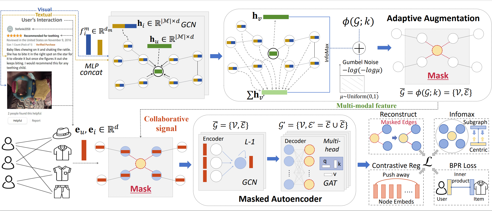

# MGCF

PyTorch implementation for paper <i>Modality-Guided Collaborative Filtering for Recommendation</i>

<p align="center">

</p>

MGCF delves into self-supervised signals derived from both the structural and semantic information of the features. These signals are then utilized to adaptively select and mask critical interactions. We evaluate the effectiveness of MGCF through extensive experiments on real-world datasets and verify the superiority of our method for multi-modal recommendation over various state-of-the-art baselines.

<h2>Dependencies </h2>

We implemented our MGCF under the following environment:
* python=3.10.12
* pytorch=1.13.1+cu116
* numpy=1.25.2
* scipy=1.11.1


<h2> Datasets </h2>

  ```
  ├─ MGCF/ 
      ├── data/
        ├── baby/...
        ├── sports/...
      ...
  ```
|    Dataset   |     Amazon-Baby  |   |  Amazon-Sports  ||   
|:------------:|:--------:|:----:|:--------:|:----:|
|   Modality   |        V    |   T  |        V    |   T  |   
|   Embed Dim  |      4096   | 1024 |      4096   | 1024 |   
|     User     |     19445  |      |      35598  |      |   
|     Item     |      7050   |      |      18357  |      |   
| Interactions |     139110  |      |      256308 |      |  
|   Sparsity   |    99.899\% |      |    99.961\% |      |   


- Following [MMSSL](https://github.com/HKUDS/MMSSL), the processed data can be downloaded at [Baby](https://drive.google.com/file/d/1bABxccOUn2xenYrHGKwgY5F7OKtRqusS/view?usp=drive_link), [Sports](https://drive.google.com/file/d/1DG_KWWYktY1s97AY2zJwDMcyqpff9Ara/view?usp=drive_link). 


<h2>Training </h2>

Start training as:

```
cd MGCF
python main.py --data baby --reg 4e-4 --centralNodes 200
python main.py --data sports --reg 2e-4 --centralNodes 400
```

<h2>Testing </h2>

We provide the checkpoints for our model, [download](https://drive.google.com/file/d/1QiA2e5vMoD-m0vxWTLb7uUMyk1ItjCfK/view?usp=drive_link) the folder ```save``` under ```/MGCF```, then:
```
cd MGCF
python test.py --data baby
python test.py --data sports
```


<h2> Experimental Results </h2>

A part of performance comparison against recent methods in terms of Recall@20 and NDCG@20. The full version is listed in the paper:

|    Baseline    |      Amazon-Baby     |                      |                Amazon-Sports    |                      |Trainable Parameters |                     |
|:--------------:|:--------------------:|:--------------------:|:--------------------:|:--------------------:|:-------------------:|:-------------------:|
|                |         R@20         |         N@20         |                    R@20         |         N@20         |        Baby         |       Sports        |
| SLMRec(TMM'22) |       0.0810         |        0.0357        |                   0.1017        |        0.0462        |   2M(2028032)       |    3.8M(3785472)    |
|  BM3(WWW'23)   |       0.0883         |        0.0383        |                   0.0980        |        0.0438        |   33M (33570688)    |    86M(86000192)    |
|  MMSSL(WWW'23) |       0.0957         |        0.0422        |                  0.0991        |        0.0471        |   38M (38160640)    |    97.8M(97809920)  |
|      Ours      |       0.0993         |        0.0438        |                   0.1118        |        0.0505        |   2M (2035776)      |    3.8M(3793216)    |       


<h2> Acknowledgement </h2>

The structure of this code is largely based on <a href='https://github.com/weiwei1206' target='_blank'>Wei Wei</a>(MMSSL) and <a href='https://github.com/akaxlh' target='_blank'>Lianghao Xia</a>(AutoCF), thanks for their work!
